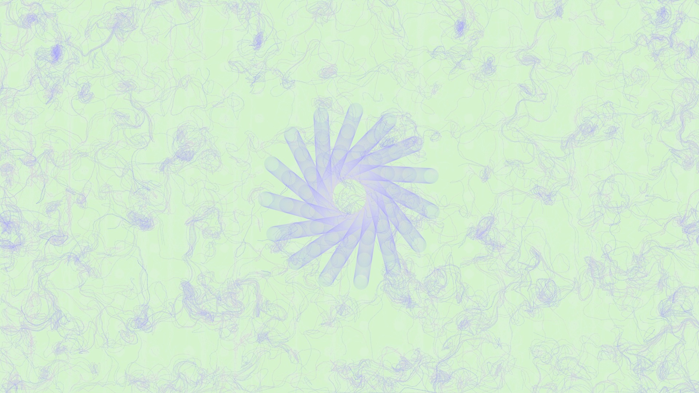
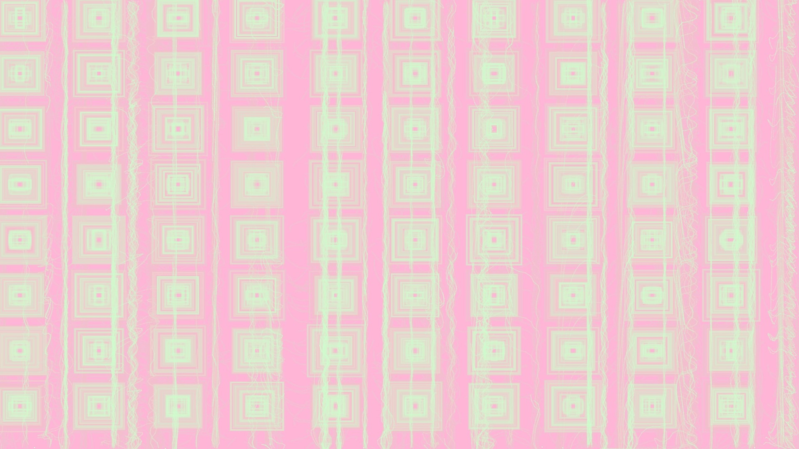
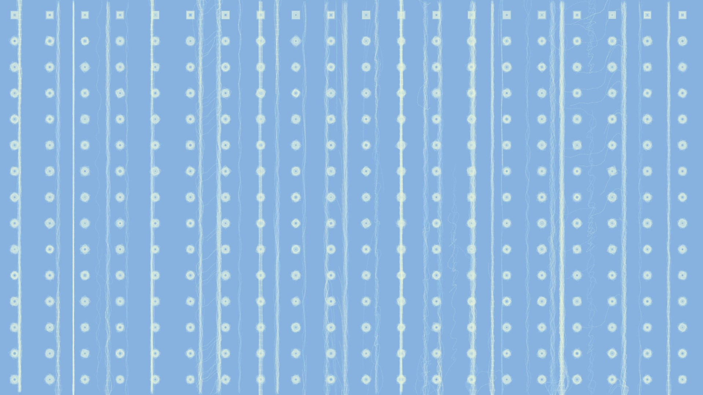
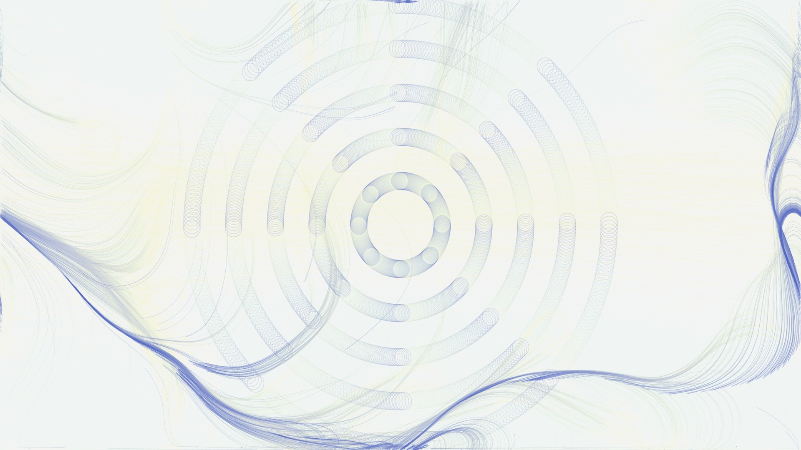
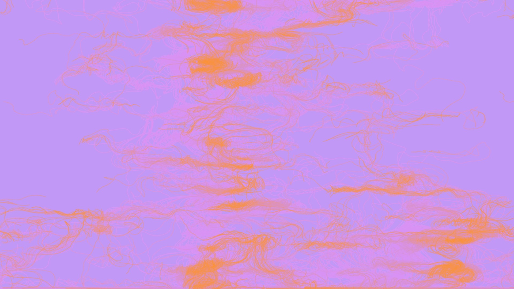
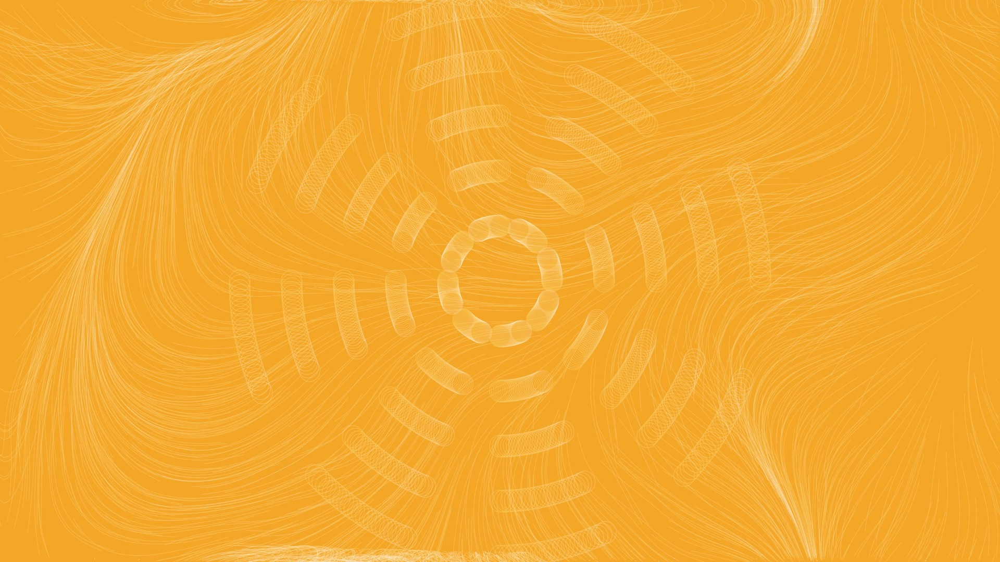
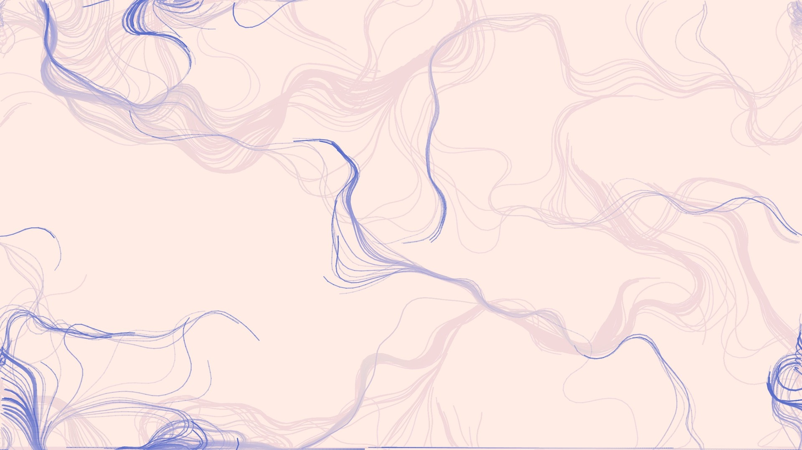
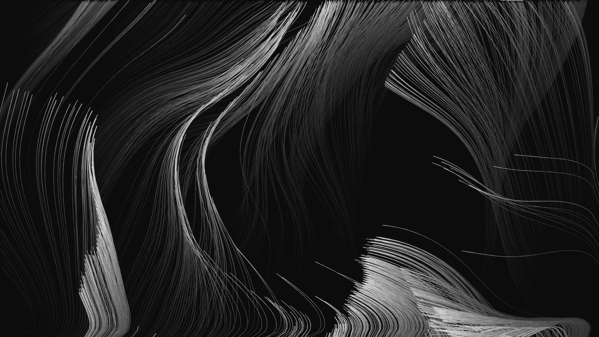

# Dream Space
### By Yujing Shi & Alodra Wang

**Dream Space** is a music synthesizer using p5.js and tone.js. The goal is to create a dreamy and playful environment for users who are interested in visual and sound. Each sound visualization represents a dream scene. When pressing the keyboard or using a physical controller, a polysynthetic chord will be produced with an underlying sound effect and visual that represents the imaginary dream scene. 

